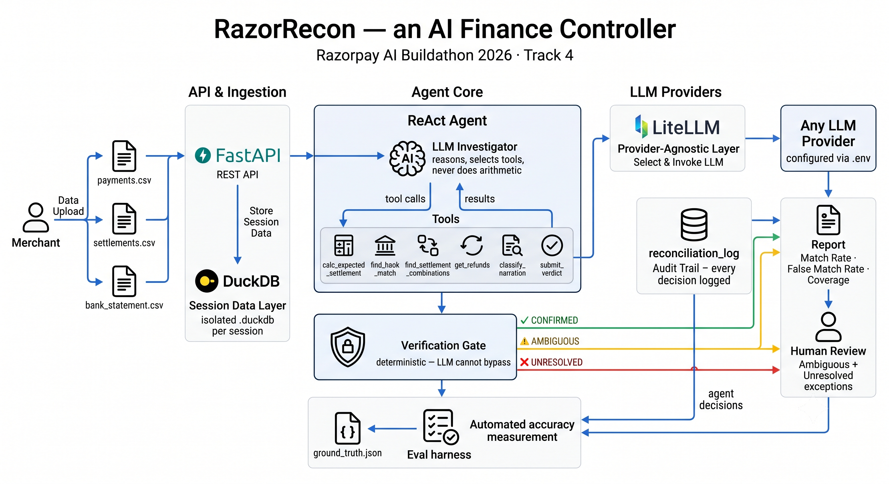
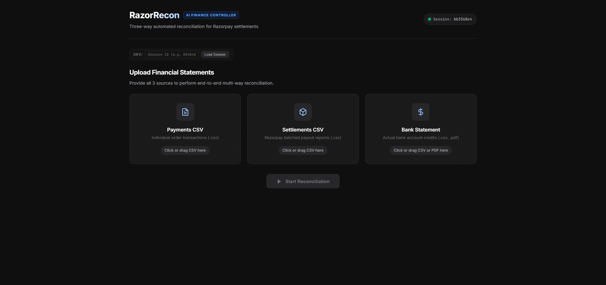
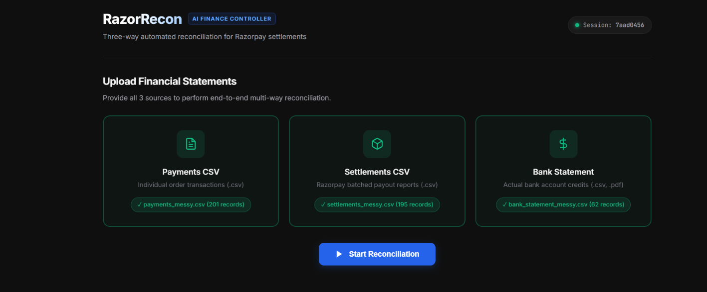
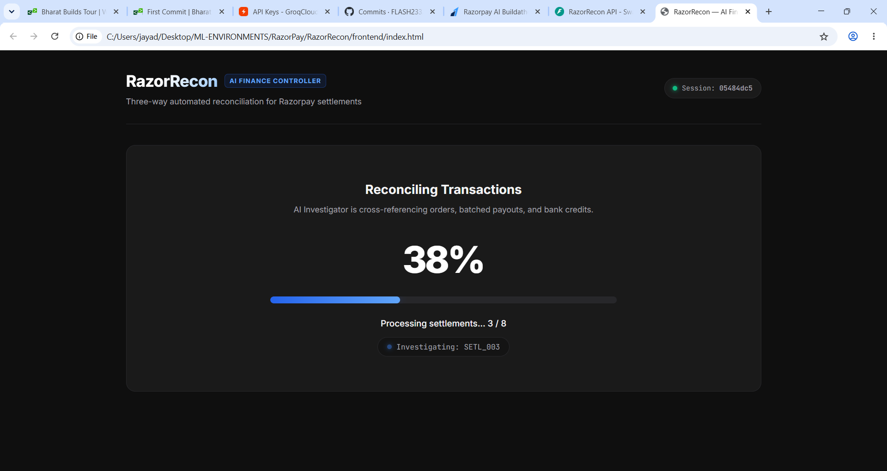
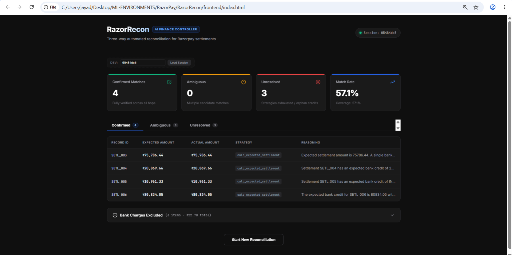
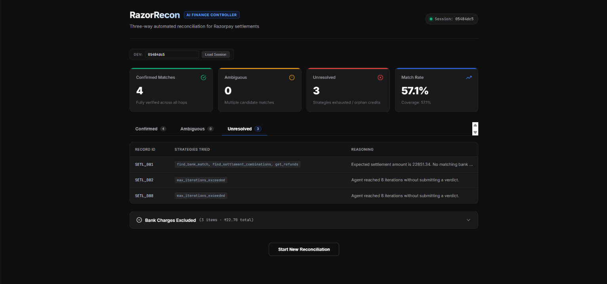
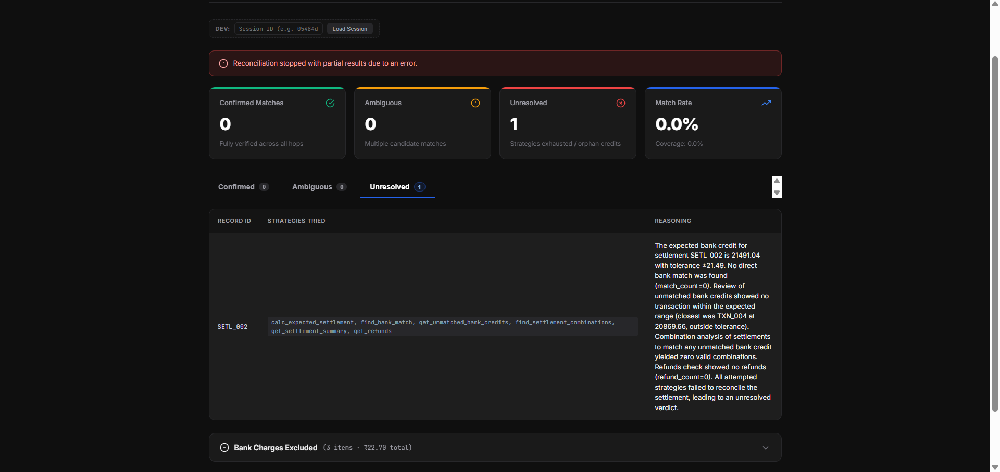

# RazorRecon — AI Finance Controller

> Razorpay AI Buildathon 2026 · Track 4: AI Finance Controller  

---

## The Problem

Every merchant on Razorpay receives payouts through a three-stage chain:

```
Customer pays → Razorpay batches & settles → Bank account receives
```

At the end of each billing cycle or month, a merchant reconciles three sources of truth that should agree but rarely do out of the box:

| Source | Format | What it records |
|--------|--------|-----------------|
| `payments.csv` | Structured CSV | Individual order transactions processed via Razorpay |
| `settlements.csv` | Structured CSV | Batched payouts after MDR, GST, and TDS deductions |
| `bank_statement.csv` | Bank statement CSV / export | Actual credits deposited into the merchant's bank account |

None of these sources speak the same language:

- **Batching:** A single settlement bundles 20–50 individual payments.
- **Amount Transformation:** Settlement payout amounts differ from gross payment sums due to MDR (2%), GST on MDR (18% of MDR), and optional marketplace TDS (1%).
- **Timing Offsets:** Bank credits arrive T+2 to T+5 days after settlement creation.
- **Fragmented Identifiers:** Bank narrations are free-text UPI or NEFT strings (e.g. `NEFT CR: HDFC 235689741234 RAZORPAY SETTLEMENT`) with no direct reference to order IDs or settlement batch IDs.
- **Statement Noise:** Bank statements contain non-reconciliation entries — quarterly SMS alert charges, bank service fees, tax deductions — that have no counterpart in Razorpay records.

Today, accountants manually cross-reference these records side by side in Excel. For a growing merchant with hundreds of transactions each month, this manual process is tedious, unaudited, and prone to costly false matches.

---

## Why This Is Hard to Automate

A naive rule engine that matches solely on exact amounts fails immediately:

```
payments:    ORD001 ₹10,000 + ORD002 ₹15,000 = ₹25,000 gross
settlement:  SETL_A ₹24,255  ← deductions applied, not ₹25,000
bank credit: ₹24,255 on Aug 3 ← but which settlement produced this payout?
```

The matching problem presents five compounding difficulties:

1. **One-to-Many Relationships:** One settlement covers $N$ payments; mapping must be inferred.
2. **Non-Linear Transformations:** Deductions and refund adjustments alter amounts at each hop.
3. **No Global Primary Key:** Orders have `order_id`, settlements have `settlement_id`, and bank credits have correspondent-bank-issued UTRs buried in unstructured narration strings.
4. **Windowed Timing:** Strict date matching fails; window-based matching introduces candidate collisions.
5. **Genuine Ambiguity:** When multiple settlement combinations sum to the exact same credit amount, a deterministic rule engine either crashes or picks one blindly. In finance, a confident false match is far worse than an honest flag for human review.

---

## The Core Insight

> **The LLM is not the source of financial truth. It is the investigator.**
>
> The LLM decides what evidence to collect, which hypotheses to explore, and which investigation tools to call. Deterministic tools execute all financial calculations, combinations, and database queries. A deterministic **Verification Gate** validates whether the collected evidence satisfies mathematical invariants before any verdict is finalized. If evidence is insufficient or contradictory, the agent abstains and routes the item to human exception review.

- **LLM:** Reasoning, strategy, and tool orchestration — never mental arithmetic.
- **Investigation Tools:** Computation, query execution, and candidate search — exact, auditable, and deterministic.
- **Verification Gate:** Conclusion gating — prevents hallucinations and forbids unverified verdicts.

---

## System Architecture



---

## What Is Built & Working

1. **Synthetic Data Generator:**
   - Multi-tier dataset generation (`tiny`, `small`, `medium`, `large`).
   - Automatically injects 4 realistic reconciliation edge scenarios:
     - `partial_refund`: Payment partially refunded mid-cycle; subtracted from settlement batch.
     - `malformed_utr`: Bank narration UTR formatted with irregular hyphens/spacing.
     - `bank_batching`: Bank combines two distinct settlements into a single credit deposit.
     - `orphan_credit`: Bank credit with no corresponding settlement record.
   - Generates ground-truth mapping (`settlement_bank_map`) for automated evaluation.

2. **DuckDB Session Data Layer:**
   - Isolated `sessions/{session_id}.duckdb` database per session.
   - Ingests raw tabular data into relational schema with zero external database dependencies.

3. **Ingestion Pipeline:**
   - Automated ingestion and column normalization for `payments.csv`, `settlements.csv`, and `bank_statement.csv`.
   - Tracks source ingestion state (`loaded`, `missing`, `record_count`).

4. **Agent Tools & Deterministic Verification Gate:**
   - Tools: `calc_expected_settlement`, `find_bank_match`, `find_settlement_combinations`, `get_refunds`, `get_settlement_summary`, `get_unmatched_bank_credits`, `classify_narration`, `submit_verdict`.
   - **Verification Gate:** LLM cannot directly finalize verdicts. It must propose evidence through `submit_verdict`, where exact amounts, tolerance windows, and competing match counts are verified before persistence.

5. **In-Memory State Context Management:**
   - Agent does not append growing conversation histories.
   - Each step rebuilds a compact state summary containing only recent structured tool observations, preventing context pollution and token runaway.

6. **Provider-Agnostic LLM Layer (LiteLLM):**
   - Seamlessly switch between cloud providers (Groq, Gemini, OpenRouter) or local inference (Ollama) via `.env`.

7. **FastAPI REST API:**
   - Asynchronous endpoints for session creation, file uploads, reconciliation execution, and report fetching.

8. **Frontend Dashboard:**
   - Clean dark-mode UI with no heavy framework dependencies.
   - Includes upload view, real-time reconciliation progress bar, tabbed decision views (Confirmed, Ambiguous, Unresolved), and bank charge noise exclusions.

9. **Report Generation & Evaluation Harness:**
   - Computes settlement match rate, false match rate, coverage, and scenario accuracy.
   - `tests/eval/run_eval.py` compares agent session results directly against generated ground truth.

---

## Financial Model

All reconciliation arithmetic adheres to standard settlement rules:

```
settlement_amount =
    Σ(eligible_payment_amounts)
  - Σ(refund_amounts for eligible payments)
  - MDR                    (2.0% of gross)
  - GST_on_MDR             (18% of MDR)
  - TDS                    (1.0% of gross, marketplace merchants only)

# Example: ₹10,000 transaction (standard D2C merchant, no TDS)
# MDR = ₹200, GST on MDR = ₹36, net settlement = ₹9,764

tolerance ε = max(₹10, 0.1% of expected_settlement)
```

- **MDR (Merchant Discount Rate):** 2.0% standard gateway fee.
- **GST on MDR:** 18% of the MDR fee.
- **TDS :** 1.0% deduction applied only in marketplace mode.
- **Refund Representation:** Deducted from future settlement batches as negative-amount adjustments against the original order.

---

## Why an Agent Over a Rule Engine

A well-engineered rule engine can match settlements deterministically —
finding combinations, handling fee deductions, even flagging ambiguity
when multiple candidates exist. We don't claim the agent beats rules on
matching logic.

The agent's real advantages are three:

**1. Explainable exceptions**

A rule engine flags: `SETL_001 → UNRESOLVED`

The agent explains:
> "Expected ₹22,851 but no bank credit found within T+5 window.
> Closest candidate was TXN_004 at ₹20,869 — outside tolerance.
> No settlement combination produces this amount. No refunds found.
> Possible cause: delayed payout or bank processing error beyond T+5."

The exception list becomes actionable, not just a list of failures.
Human reviewers know exactly what to verify instead of investigating from scratch.

**2. Novel edge cases without new rules**

A rule engine catches only what it was programmed to catch.
When an unseen pattern appears — a bank splitting one settlement into
two partial credits, a fee structure change, a new narration format —
the rule engine misses it silently.

The agent reasons from first principles. It notices that two bank credits
sum to an expected settlement amount, investigates, and flags it for review
even though no rule existed for that pattern.

**3. Knowing when to abstain**

This is the core of Razorpay's "verification capacity" framing.

When two settlement combinations produce identical bank credit amounts,
a rule engine must pick one — and is wrong 50% of the time.

The agent detects competing explanations and abstains:
> "Two valid combinations found. Cannot determine correct match without
> additional evidence. Routing to human review with both options listed."

A confident wrong match is worse than an honest flag.
The verification gate enforces this — the LLM cannot confirm a match
unless evidence is unambiguous. Abstaining is a first-class output,
not a failure mode.

---

## Tech Stack

- **Python 3.11+**: Core backend runtime.
- **FastAPI**: Asynchronous REST API layer and session management.
- **DuckDB**: Embedded, session-isolated data warehouse (`.duckdb` files).
- **LiteLLM**: Unified, provider-agnostic LLM interface.
- **Groq / OpenRouter**: Low-latency cloud LLM inference.
- **Ollama**: Local open-weights model inference.
- **Vanilla HTML5 / JavaScript / CSS**: Dependency-free frontend interface.

---

## Setup & Quickstart

### Prerequisites
- Python 3.11+ (Python 3.12 or 3.13 recommended)
- Git

### Installation

```bash
# Clone the repository
git clone https://github.com/FLASH2332/RazorRecon
cd RazorRecon

# Create and activate virtual environment
python -m venv venv

# Windows:
venv\Scripts\activate
# Mac/Linux:
# source venv/bin/activate

# Install dependencies in editable mode
pip install -e .
```

### Configuration

Copy `.env.example` to `.env`:

```bash
cp .env.example .env
```

Configure your preferred model provider in `.env`:

```ini
# Option 1: Groq (Recommended for speed)
LLM_MODEL=groq/qwen/qwen-2.5-32b-instruct
GROQ_API_KEY=gsk_...

# Option 2: Gemini
LLM_MODEL=gemini/gemini-1.5-flash
GEMINI_API_KEY=AIza...

# Option 3: Ollama (Local inference, requires 8GB+ VRAM)
LLM_MODEL=ollama/qwen2.5:7b

# Option 4: OpenRouter
LLM_MODEL=openrouter/meta-llama/llama-3.3-70b-instruct
OPENROUTER_API_KEY=sk-or-...
```

### Generate Sample Data

Generate clean and scenario-injected test datasets:

```bash
# Generate sample datasets across small, medium, and large sizes
python -m data.generator.generate all
```

Generated datasets will be saved under `data/sample/`.

### Run the Application

1. **Start the API server:**
   ```bash
   uvicorn api.main:app --reload --port 8000
   ```

2. **Open the Frontend:**
   Open `frontend/index.html` in your web browser (or serve via any local HTTP server).

3. **Reconcile:**
   - Upload `payments.csv`, `settlements.csv`, and `bank_statement.csv` from `data/sample/small/` (or `medium/`).
   - Click **Run Reconciliation** to watch the agent investigate records in real-time.

### Run Evaluation Harness

To measure reconciliation performance against ground truth for a completed session:

```bash
python -m tests.eval.run_eval <session_id> data/sample/medium
```

The evaluation report computes:
- Total settlements processed
- Match rate & coverage
- **False match rate** (safety metric)
- Edge case scenario coverage (`partial_refund`, `malformed_utr`, `bank_batching`, `orphan_credit`)

---

## What Is Out of Scope (Current Release)

To maintain clarity on project boundaries:

1. **PDF Bank Statement Parsing:** Scaffolded in `data/ingestion/pdf_parser.py`, but bank statement input is currently processed via CSV exports for maximum benchmark reliability.
2. **Settlement Q&A Natural Language Chat:** Conceptualized for future interactive querying; currently omitted to focus entirely on core reconciliation accuracy.
3. **Authentication & Multi-Tenancy:** Single merchant session isolation is implemented via separate DuckDB databases.
4. **Cloud Infrastructure Deployment:** Configured for local workstation execution; cloud containerization is planned as future deployment work.

## Demo









   



## Repository Structure

```
razorrecon/
├── data/
│   └── generator/
│       ├── generate.py          # main entry point, all dataset sizes (tiny/small/medium/large)
│       ├── payments.py          # payment + refund row generation
│       ├── settlements.py       # settlement generation with fee math (MDR, GST, TDS)
│       ├── bank_statement.py    # bank credit generation + narration formatting + settlement_bank_map
│       ├── scenarios.py         # scenario injection (partial refund, malformed UTR, batching, orphan)
│       └── validate_config.py   # validation checks for dataset generator configs
│
├── engine/
│   ├── agent.py                 # ReAct loop, in-memory state context rebuild, LiteLLM retry
│   ├── verification.py          # verification layer — deterministic verdict rules
│   ├── report.py                # report compilation, metrics calculation
│   ├── llm_client.py            # LiteLLM client wrapper for simple completions
│   ├── pdf_parser.py            # pdfplumber table extraction pipeline (scaffolded)
│   └── tools/
│       ├── registry.py          # tool wrappers, schemas, submit_verdict + verification gate
│       ├── compute.py           # calc_expected_settlement, combination finder (subset-sum)
│       ├── query.py             # query_settlements, query_bank_txns, candidate search
│       ├── classify.py          # classify_narration, extract_utr regex parser
│       ├── resolution.py        # mark_confirmed, mark_ambiguous, mark_unresolved, verdict log
│       └── ingestion.py         # DuckDB session init, schema setup, CSV ingestion
│
├── api/
│   ├── main.py                  # FastAPI app, CORS middleware, route registration
│   ├── routers/
│   │   ├── sessions.py          # session creation (POST /sessions), state inspection
│   │   ├── upload.py            # CSV file uploads (payments, settlements, bank statement)
│   │   ├── reconcile.py         # trigger agent investigation loop (POST /sessions/{id} reconcile)
│   │   ├── report.py            # fetch reconciliation report & verdict summary
│   │   └── qa.py                # natural language settlement Q&A (scaffolded)
│   └── session/
│       └── manager.py           # session lifecycle, DuckDB database file management
│
├── frontend/
│   ├── index.html               # single-page dark dashboard layout
│   ├── dashboard.js             # upload flow, live progress polling, report table, session 
│   └── style.css                # dashboard theme and custom styling
│
├── tests/
│   ├── test_reconciler.py       # unit tests for reconciliation logic
│   ├── test_verification.py     # verification layer rules & tolerance asserts
│   ├── test_context_extraction.py # in-memory state & tool key result compression tests
│   ├── test_pdf_parser.py       # parser test harness on sample PDFs
│   └── eval/
│       ├── run_eval.py          # evaluation harness against ground truth & safety metrics
│       └── held_out/            # held-out evaluation dataset directory
│
├── pyproject.toml               # project metadata and dependencies
├── AGENTS.md                    # technical architecture reference for judges & contributors
├── .env.example                 # sample environment variables (LiteLLM provider configs)
└── README.md
```
